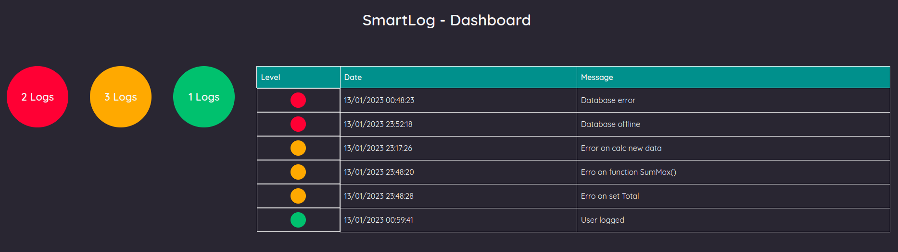

# SmartLog

### Application

The goal is manage all logs at the same single page



## 🛠 Technologies and Frameworks
- [.NET 7](https://dotnet.microsoft.com/en-us/download/dotnet/7.0)
- [AutoMapper](https://automapper.org/)
- [EntityFrameworkCore](https://www.entityframeworktutorial.net/efcore/entity-framework-core.aspx)
- [Razor Pages](https://docs.microsoft.com/pt-br/aspnet/core/razor-pages/?view=aspnetcore-6.0&tabs=visual-studio)

## Running the application
```bash
# Clone this repository or download .zip and extract the files
$ git clone <https://github.com/GuilhermeAFerrari/SmartLog.git>

# Access the project's folder and open the solution file with Visual Studio or Visual Studio Code

# Open the appsetting.json file and configure your connection string for the database adding or editing the values in the "ConnectionStrings" key

# In the package manager console execute the command to run the migrations
$ dotnet ef database update

# Run the application (CRTL+F5)
```

## Features
- Logs management

## 😎 Author
- Guilherme Ferrari
- E-mail: guile.ferrari@hotmail.com
- [](https://www.linkedin.com/in/guilherme-antonio-ferrari/)

## 📝 License
MIT.